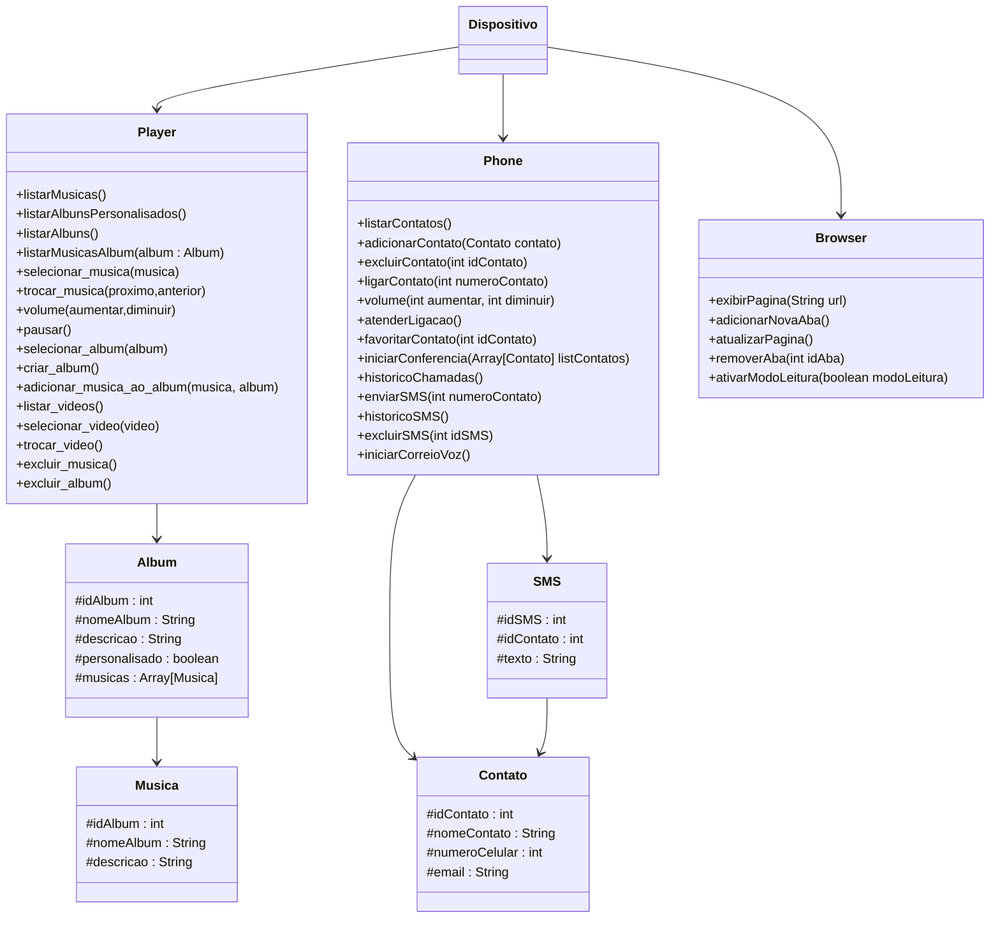

# [DIO](www.dio.me) - Trilha Java Básico

## POO - Desafio

### Modelagem e Diagramação de um Componente iPhone

Neste desafio, você será responsável por modelar e diagramar a representação UML do componente iPhone, abrangendo suas funcionalidades como Reprodutor Musical, Aparelho Telefônico e Navegador na Internet.

#### Funcionalidades a Modelar
1. **Reprodutor Musical**
   - Métodos: `tocar()`, `pausar()`, `selecionarMusica(String musica)`
2. **Aparelho Telefônico**
   - Métodos: `ligar(String numero)`, `atender()`, `iniciarCorreioVoz()`
3. **Navegador na Internet**
   - Métodos: `exibirPagina(String url)`, `adicionarNovaAba()`, `atualizarPagina()`

### Exemplo de Diagrama UML (Mermaid)
